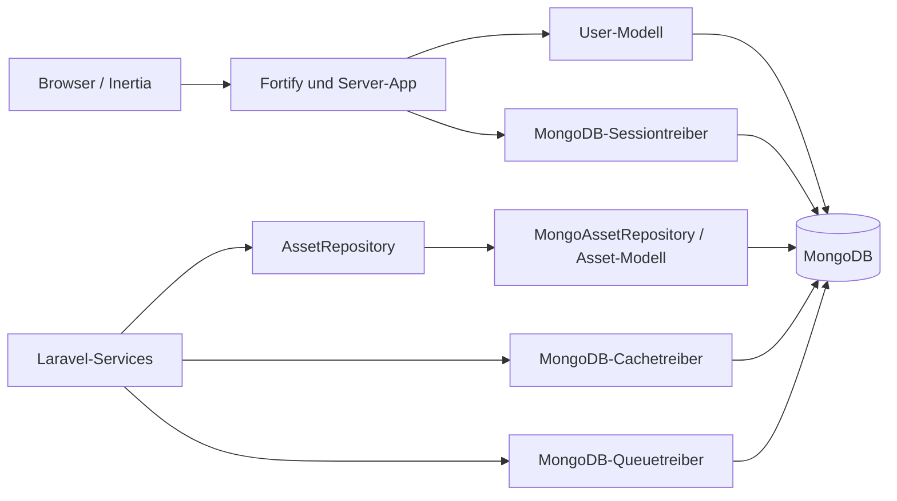

# Aufgabe 4.2.2 – Persistenz ausschliesslich mit MongoDB

Stand: 15. August 2026

## Ausgangslage und Ziel

Die Laravel-Anwendung verwendete im Ausgangszustand SQLite als Standarddatenbank. Benutzer, Passwort-Reset-Tokens, Sessions, Cache- und Queue-Daten waren damit auf relationale Startertabellen oder alternative lokale Treiber ausgerichtet. Für die neue Asset-Verwaltung sollte dagegen MongoDB eingesetzt werden. Zwei gleichzeitig aktive Persistenztechnologien hätten die Konfiguration, den Betrieb und die Fehleranalyse unnötig erschwert.

Nach der Umstellung ist MongoDB die einzige aktive Datenbankverbindung. Benutzer und Assets sowie die technischen Collections für Fortify, Sessions, Cache und Queue liegen in derselben MongoDB-Datenbank. Die frühere SQLite-Datei wurde gemäss dem vereinbarten Neustart ohne Datenübernahme entfernt. Für automatisierte Tests wird ausschliesslich die separate Datenbank `mertens_asset_management_test` verwendet. Ein Schutz im Test-Bootstrap verweigert destruktive Testmigrationen, wenn der Datenbankname nicht auf `_test` endet.

Web-API, API-Authentisierung und API-Endpunkte sind nicht Bestandteil dieses Arbeitspakets.

## Begründung des Dokumentmodells

Ein Asset wird häufig zusammen mit seinem aktuellen Standort, seinem Lieferanten-Snapshot und dem aktuellen Wartungszustand gelesen. Diese Informationen sind klein, haben denselben Lebenszyklus wie das Asset und wachsen nicht unbegrenzt. Deshalb werden `location`, `supplier` und `maintenance` als eingebettete Objekte gespeichert. Dadurch ist für die typische Asset-Ansicht kein Join und keine zusätzliche Abfrage notwendig.

Die unbegrenzt wachsende Wartungshistorie ist bewusst nicht eingebettet und nicht Teil dieses ersten Modells. Falls sie später benötigt wird, kann sie als eigene Collection mit Referenz auf das Asset modelliert werden. Dieses Vorgehen verhindert unkontrolliert wachsende Asset-Dokumente.

MongoDB erzeugt die technische `_id` als `ObjectId`. Im Laravel-Modell wird sie als String über `id` verwendet. Geschäftliche Identifikatoren werden unabhängig davon durch eindeutige Indizes abgesichert. Eine strikte MongoDB-Schema-Validierung stellt sicher, dass Pflichtfelder vorhanden sind, BSON-Typen stimmen und nur die definierten Statuswerte akzeptiert werden.

## Datenfluss



Das Repository trennt die spätere API- oder UI-Schicht vom konkreten Datenzugriff. `AssetRepository` definiert Pagination und CRUD; `MongoAssetRepository` implementiert diese Operationen mit dem MongoDB-Eloquent-Modell. Ungültige oder unbekannte Objekt-IDs liefern `null`. Schema- und Eindeutigkeitsfehler werden absichtlich weitergegeben, damit eine spätere API-Schicht passende HTTP-Antworten erzeugen kann.

## Asset-Beispiel

Das folgende Extended-JSON-Dokument wurde nach `migrate:fresh --seed` aus MongoDB ausgelesen. Die von MongoDB erzeugte `_id` wurde für die Dokumentation ausgelassen.

```json
{
  "asset_number": "AST-00001",
  "name": "CNC Fräsmaschine DMU 50",
  "category": "production",
  "status": "active",
  "serial_number": "SN-DMU50-001",
  "location": {
    "site": "Hauptsitz",
    "building": "A",
    "room": "101"
  },
  "supplier": {
    "external_id": "SUP-0001",
    "name": "DMG MORI Schweiz AG"
  },
  "maintenance": {
    "last_completed_at": { "$date": "2026-02-15T00:00:00Z" },
    "next_due_at": { "$date": "2027-02-15T00:00:00Z" },
    "interval_days": 365
  },
  "acquired_at": { "$date": "2022-01-01T00:00:00Z" },
  "warranty_until": { "$date": "2027-12-31T00:00:00Z" },
  "created_at": { "$date": "2026-08-15T06:07:29.459Z" },
  "updated_at": { "$date": "2026-08-15T06:07:29.459Z" }
}
```

## Collections und Indizes

| Collection | Zweck | Wichtige Indizes / Validator |
|---|---|---|
| `migrations` | Migrationsstatus | `_id_` |
| `users` | Fortify-Benutzer | `users_email_unique`; strikter JSON-Schema-Validator |
| `password_reset_tokens` | Passwort-Reset | eindeutige E-Mail; `created_at_1` |
| `sessions` | Web-Sitzungen | `user_id_1`, `last_activity_1`, TTL auf `expires_at` |
| `cache` | Cache-Einträge | TTL auf `expires_at` |
| `cache_locks` | atomare Cache-Locks | TTL auf `expires_at` |
| `jobs` | Queue-Aufträge | `queue_1`, Suchindizes für verfügbare und reservierte Jobs |
| `job_batches` | Queue-Batches | `_id_` |
| `failed_jobs` | fehlgeschlagene Jobs | eindeutige UUID; Index auf Verbindung, Queue und Fehlerzeit |
| `assets` | Asset-Stammdaten | eindeutige Asset-Nummer; eindeutige sparse Seriennummer; `status` + `maintenance.next_due_at`; strikter JSON-Schema-Validator |

Die TTL-Indizes verwenden `expireAfterSeconds: 0`. Damit enthält das jeweilige BSON-Datum den tatsächlichen Ablaufzeitpunkt. MongoDB entfernt abgelaufene Dokumente asynchron über seinen TTL-Monitor.

## Arbeitsprotokoll

| Schritt | Tätigkeit | Werkzeug / Befehl | Ergebnis und Fehlerbehebung |
|---:|---|---|---|
| 1 | Paketstände und projektspezifische Regeln geprüft | `composer show --direct`, Laravel-Boost-Dokumentationssuche | Laravel 13.24, `mongodb/laravel-mongodb` 5.9.1 und die PHP-Erweiterung waren bereits vorhanden; keine neue Abhängigkeit nötig. |
| 2 | Standardverbindung, Session, Cache und Queue auf MongoDB umgestellt | Anpassung von `.env`, `.env.example`, `config/*.php` und `phpunit.xml` | Alle aktiven Persistenztreiber zeigen auf MongoDB; Tests verwenden die getrennte `_test`-Datenbank. |
| 3 | Laravel-13-Konfigurations-Merge begrenzt | `php artisan config:show database` | Laravel ergänzte zunächst seine SQL-Beispielverbindungen zur Laufzeit. Der `AppServiceProvider` reduziert `database.connections` explizit auf `mongodb`. |
| 4 | Relationale Startermigrationen ersetzt | `php artisan migrate:fresh --seed --force` | Zehn Collections, Validatoren, TTL-, Such- und Eindeutigkeitsindizes wurden erfolgreich erstellt. |
| 5 | Benutzerpersistenz für Fortify angepasst | MongoDB-Authenticatable, String-ID, Fortify-Regressionstests | Registrierung, Login/Logout, Reset, Verifizierung, Profiländerung und Löschung arbeiten mit MongoDB. Die Profilvalidierung wurde für `int|string|null`-IDs erweitert. |
| 6 | Asset-Modell und Data-Access-Layer umgesetzt | `Asset`, `AssetRepository`, `MongoAssetRepository` | Pagination und vollständiges CRUD funktionieren; eingebettete Wartungsdaten werden als BSON-Datum normalisiert. |
| 7 | Demonstrationsdaten erstellt | `AssetFactory`, `AssetSeeder`, `DatabaseSeeder` | Ein reproduzierbarer Benutzer und vier nachvollziehbare Assets werden angelegt. |
| 8 | Infrastruktur- und Regressionstests ausgeführt | `php artisan test --compact` | 46 Tests; 43 bestanden, 3 optionale Tests übersprungen; 187 Assertions. Keine Fehler. |
| 9 | Statische Analyse und Formatierung ausgeführt | `vendor/bin/phpstan analyse --no-progress`, `vendor/bin/pint --format agent` | PHPStan Level 7 ohne Befund; Pint erfolgreich. `--dirty` war nicht verfügbar, weil der Arbeitsordner kein Git-Repository ist, deshalb wurde der gesamte PHP-Bestand formatiert. |
| 10 | SQLite-Reste gesucht | `rg` und Dateisuche ausserhalb von Abhängigkeiten und Dokumentation | Keine aktive SQLite-Konfiguration und keine SQLite-Datei im Projekt vorhanden. |

Ein anfänglicher Verbindungs-Timeout während der automatisierten Ausführung lag an der isolierten Entwicklungsumgebung, nicht an MongoDB. Der lokale Dienst beantwortete den direkten Ping mit `{ ok: 1 }`; Migrationen und Tests wurden anschliessend mit freigegebenem lokalem Datenbankzugriff ausgeführt.

## Nachweise und Screenshots

Für die Abgabe sollten folgende Ansichten aus MongoDB Compass oder `mongosh` aufgenommen werden:

1. Datenbankansicht mit den zehn Collections.
2. Indexansicht von `assets` mit eindeutigem `asset_number`, eindeutigem/sparse `serial_number` und dem zusammengesetzten Wartungsindex.
3. Indexansicht von `sessions`, `cache` und `cache_locks` mit den TTL-Indizes.
4. Das Seed-Dokument `AST-00001` sowie je ein dokumentierter Create-, Update- und Delete-Vorgang.
5. Terminalausgabe des Asset-Repository-Tests und der vollständigen Fortify-Regression.

Vor der Aufnahme sind Verbindungszeichenfolgen, Benutzernamen, Kennwörter und Atlas-Zugangsdaten auszublenden. Für `mongosh` kann die URI aus einer nicht angezeigten Umgebungsvariable gelesen werden:

```bash
mongosh "$MONGODB_URI/$MONGODB_DATABASE"
```

## Quellen

- [Laravel 13 – MongoDB](https://laravel.com/docs/13.x/mongodb)
- [Laravel MongoDB – offiziell unterstützte Funktionen](https://www.mongodb.com/docs/drivers/php/laravel-mongodb/current/)
- [MongoDB – Schema Validation](https://www.mongodb.com/docs/manual/core/schema-validation/)
- [MongoDB – Embedded Data](https://www.mongodb.com/docs/manual/data-modeling/embedding/)
